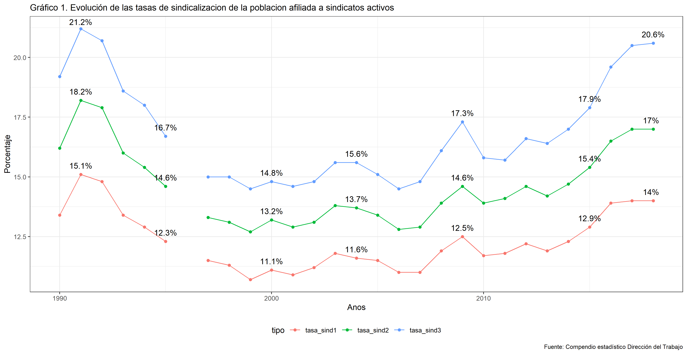

```{r setup, include=FALSE}
knitr::opts_chunk$set(echo = TRUE)
```

## Datos sobre sindicatos y negociaciones colectivas en Chile

La Dirección del Trabajo publica interesante información estadística sobre sindicatos, negociaciones colectivas y huelgas en sus [compendios estadísticos](https://www.dt.gob.cl/portal/1629/w3-propertyvalue-22777.html) para los años 1990-2018. Sin embargo, las tablas se encuentran en formato `pdf`, lo que dificulta su uso y análisis. Con el objeto de hacerle la vida más fácil a los y las colegas, y a nosotros mismos cuando queremos usar los datos, elaboramos esta página con los gráficos y tablas más partinentes.



[Descargar datos](Output/Cuadros/1. OOSS/cuadro1.xlsx)